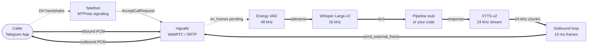

#p2p-offline-ai-telegram-bridge

A locally running, offline AI – reachable via Telegram voice call (pure voice bridge, no bot). It answers calls, detects motion at the door and sends a live image – all deterministic, on own hardware, without cloud.

[](LICENSE)
[](https://www.python.org/)
[]()
[]()
[]()

Low-level integration of Telegram P2P voice calls with external PCM audio sources. Built directly on Telethon (MTProto signaling) and ntgcalls (WebRTC transport) — no high-level wrappers.

---

## What this is

A working proof-of-concept for handling **private 1-on-1 Telegram voice calls** with raw PCM access in both directions. The high-level wrapper `py-tgcalls` does not expose private calls or raw audio callbacks for 1-on-1 sessions in its stable release, so this project bypasses it and uses ntgcalls' native pybind11 bindings directly.

Default intended pipeline: inbound PCM is routed through VAD and Whisper, response text is generated by a local pipeline stub, and XTTS-v2 streams outbound PCM back into the call. Outbound P2P audio is verified; private P2P inbound PCM depends on an upstream ntgcalls fix or a group-call workaround.

---

## Current status (May 2026)

| Component | Status |
|---|---|
| Auto-answer (UpdatePhoneCall + AcceptCallRequest) | ✅ Working |
| DH key exchange (Telethon ↔ ntgcalls) | ✅ Working |
| WebRTC P2P connection (CONNECTED state) | ✅ Working |
| Bidirectional MTProto signaling relay | ✅ Working |
| **Outbound audio** (`send_external_frame`, XTTS streaming) | ✅ Working |
| **Inbound audio** (`on_frames` for P2P calls) |  [ntgcalls#44](https://github.com/pytgcalls/ntgcalls/issues/44) |
| Clean call teardown | ✅ Working |

**About the inbound audio limitation:** ntgcalls 2.1.0 does not deliver `on_frames` callbacks for private 1-on-1 P2P calls — the WebRTC `PacedSender` remains paused because `SignalNetworkState` is never set to `Up`. This is a confirmed upstream library issue, not a configuration error in this project. Group voice chats are not affected.

## Scope

This project does:

- Auto-answer Telegram P2P voice calls
- Stream synthesised audio into the call (outbound)
- Provide a verified raw-PCM I/O contract for ntgcalls 2.1.0
- Offer a clean integration point for any local STT / LLM / TTS pipeline

This project does NOT:

- Record, store or relay any conversation content
- Bypass any Telegram security mechanism
- Operate as a mass-call, autodial or spam tool
- Require any cloud service for the audio pipeline

---

## Architecture



| Layer | Library | Responsibility |
|---|---|---|
| Signaling | Telethon | MTProto, DH key exchange, call accept/discard, signaling relay |
| Transport | ntgcalls 2.1.0 | WebRTC/SRTP, raw PCM I/O, RTC server negotiation |
| Speech-in | faster-whisper | Transcription, 16 kHz |
| Speech-out | Coqui TTS (XTTS-v2) | Streaming synthesis with voice cloning, 24 kHz |
| VAD | Energy-based (built-in) | Replace with silero-vad for production |

---

## Requirements

- Windows x86_64
- NVIDIA GPU with CUDA 12.1 (tested on RTX 3070, 8 GB VRAM)
- Python 3.10 or newer
- Telegram account with `api_id` / `api_hash` from [my.telegram.org/apps](https://my.telegram.org/apps)

---

## Install

The install order matters. `pip install -r requirements.txt` alone will let Coqui TTS pull its own torch wheel and silently downgrade your CUDA build. Follow these steps in order.

```bash
python -m pip install --upgrade pip setuptools wheel

pip install torch==2.5.1+cu121 torchaudio==2.5.1+cu121 \
    --index-url https://download.pytorch.org/whl/cu121

pip install ntgcalls==2.1.0 --no-deps
pip install "Telethon>=1.36.0,<2.0.0" cryptg --no-deps

pip install "faster-whisper>=1.0.0,<2.0.0" "numpy>=1.26.0,<2.0.0" "scipy>=1.13.0,<2.0.0" "soundfile>=0.12.1,<1.0.0"

pip install TTS==0.22.0 --no-deps
```

> **Why `--no-deps` everywhere:** Coqui TTS, faster-whisper and ntgcalls all declare loose torch dependencies. Without `--no-deps`, pip will silently downgrade your CUDA-enabled torch to the CPU build, breaking GPU inference. This is not optional on Windows + CUDA 12.1.

---

## Configuration

```bash
cp config.example.json config.json
```

Edit `config.json` with your Telegram `api_id`, `api_hash`, phone number, and a path to a 6–30 second WAV speaker reference for XTTS voice cloning.

---

## Run

```bash
python nova_voice_call.py
```

On first run, Telethon will prompt for the SMS code Telegram sends to your phone. The session is then cached. Once running, any incoming voice call to the configured account is auto-accepted and answered by the pipeline.

---

## Audio specifications

| Parameter | Value |
|---|---|
| Call sample rate | 48 000 Hz |
| Channels | mono |
| Frame size | 480 samples (10 ms) |
| Frame bytes | 960 bytes (int16 LE) |
| Sample format | PCM int16 little-endian |
| Whisper sample rate | 16 000 Hz (resampled internally) |
| XTTS sample rate | 24 000 Hz (resampled to 48 kHz before send) |

> **Note on frame size:** ntgcalls 2.1.0 `AudioSink.frameTime()` is **10 ms**, not 20 ms (a common misconception). Sending 20 ms frames causes jitter buffer underruns. Verified against `ntgcalls/src/media/audio_sink.cpp`.

---

## Custom pipeline

Replace `EchoPipeline` in `nova_voice_call.py` with your own logic:

```python
class MyPipeline:
    def process(self, text: str) -> str:
        return your_logic(text)
```

The pipeline runs in a thread pool — non-blocking with respect to the audio I/O thread.

---

## License

AGPL-3.0 — see [LICENSE](LICENSE).

If you integrate this into a network-accessible service, your service source must be made available under the same license.

---

NovaMind Studios — Niedergösgen, Switzerland  
ki27@ik.me  
[txpkev.github.io/NOVAMINDSTUDIO](https://txpkev.github.io/novamindstudio)
